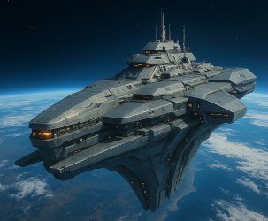

# 👾Agentic AI Hackathon 2125
*The Agentic AI Hackathon to save the human race.*

## 🎖️Welcome Space Cadets!
This is the Agentic AI Hackathon 2125 Game.

## 👾Story
The year is 2125.

A hundred years ago, we sent out unmanned deep-space probes in search of worlds suitable for colonization. One of these probes was found. Found by “Them”.

“They” intercepted the probe, tampered with it, and attempted to open it. The resulting explosion must have killed hundreds of them. 
They saw this as an act of war and responded with deadly force. Nothing could stop them. 
War broke out across the entire sector and has raged for the past century. 
Now, they plan to attack humanity’s last bastion. The Earth itself.

But today marks the end of their plans. 
Today, we will no longer retreat! 
Today, we take back what is ours!

## 🤔Situation
You are Space Cadets of the last human space fleet. Your spaceship name is CSS Titan (CSS is for Command Space Ship).

On behalf of all people, we are to fight humanity's "last battle"!

Communication to other spaceships is broken.
* "They" destroyed our default communication channels.
* BUT: There is watsonx, a 2025 good old "earth age" software.
* watsonx looks surprisingly good for a 100-year-old human written software.

With watsonx, we can orchestrate other spaceships by indirectly tapping into their onboard control systems.
  * Orchestrated spaceships (so-called "Agents") use the Agent Communication Protocol (ACP).
  * "They" classified the ACP as "not harmful". Fools.

Our space fleet consists of
  * Several functional spaceships that we can orchestrate
  * Many defender spaceships, which we can send out if we are under attack

## 👽Problem
We are under attack! 
We need the CSS Titan to **create battle plans** for appearing enemy spaceships.

All you need, is the following mission guide.

The survival of humanity depends on you!

## 📖 Rules
You will compete in several missions. 
After each mission, call a Space Instructor to get your solution verified. 
You will be rated with Space Points. 
There is no exact solution on how to solve the missions. 
Creativity wins. 
Good luck, Space Cadets!

## 🚀Next step: The Mission 1 Guide

You can find step-by-step instructions here: [Mission 1: The Battle Plan](mission_1_the_battle_plan.md).

## 🤖Authors
IBM and Cloudflight joint (space) forces to make you a hackathon.

**Have fun, Space Cadets!**

*Disclaimer: This text is, believe it or not, generated by humans.*
