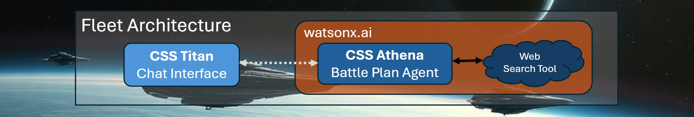
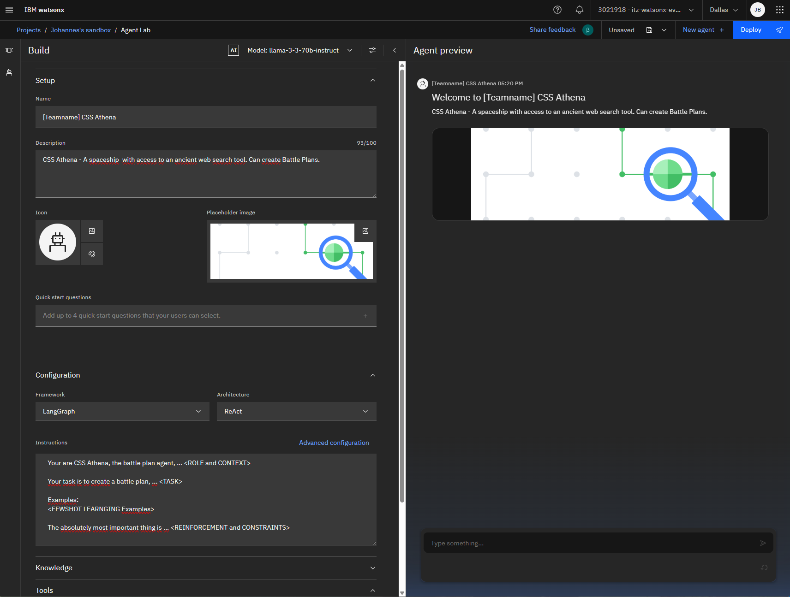
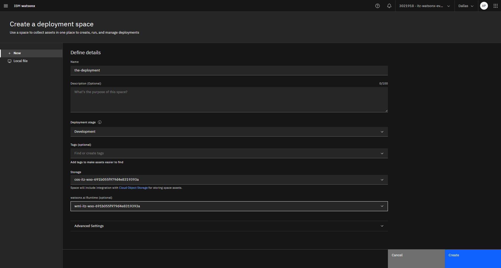
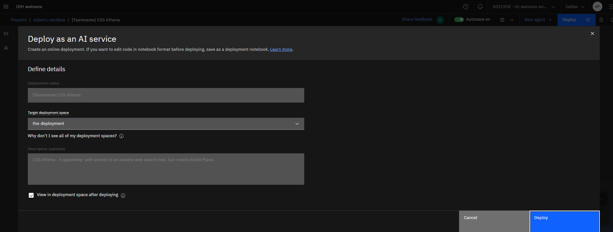

# 🚀Mission 1: The Battle Plan
*Your guide to build Agentic AI .. and save the human race.*


## 🫡Let's go Space Cadets!
The main goal is to build a solid defense line with our spaceships.<br>
Therefore, we will continuously connect all our spaceships' onboard control systems.<br>
In 2025, this strategy was known as "Agentic AI", and with watsonx we can build it up today!

## 💡Mission Requirements
To successfully solve your first mission, you need to
* write a so-called _Instruction_ for CSS Athena to enable the creation of battle plans
* present your solution to one of the Space Instructors

## 🚀CSS Athena – The Battle Plan Agent
A spaceship with access to an ancient web search tool. Has some kind of battlefield intelligence.



### Story & Requirement
In order to defend "their" spaceships' heavy laser attacks, our spaceships need to have their
chromatic shields in the **complementary color to the attackers' laser colors**, according to the traditional RYB color model.<br>
For example **green** lasers would be defended by **red** shields.

### CSS Athena Capability: The Battle Plan
For a given spaceship overview and information to incoming attacking spaceships,
develop a detailed plan on which of our spaceships should be sent as defenders.

**Valid solutions require to contain:**
* the correct shield color to defend the attacking spaceship
* a link to a page that explains the color decision
* a motivating message to the Commander. In wartime, morale is absolutely crucial.

**Examples for requests to CSS Athena:**

```
Example 1:
"They" are coming! There is a spaceship with blue lasers!
We have spaceships with red, orange, green or blue colored shields to defend.
We need a battle plan!

Example 2:
We are under attack, red laser weapons are trying to break our defense.
Should we defend with green or with yellow shields?
Create a battle plan!

Example 3:
There are 2 spaceships with yellow lasers attacking our commander spaceship! We need to defend now!
Our fleet has 2 red-shielded, 3 green-shielded and 5 blue-shielded spaceships to defend.
What is the plan?
```

**Example for a valid solution:**
```
 Example request:
    | "They" are coming! There is a spaceship with blue lasers!
    | We have spaceships with red, orange, green or blue colored shields to defend.

 Example for a valid response:
    | Battle Plan
    | The fate of humanity hangs in the balance as "they" approach with their blue laser-equipped spaceship.
    | Our defense relies on choosing the right spaceship with a shield color that complements the attackers' laser color.
    | According to the traditional RYB color model, the complementary color of blue is orange.
    | Therefore, we should select the spaceship with an orange-colored shield to defend against the incoming attack.
    |
    | Good luck, Commander!
    |
    | If you don't trust my color understanding, check out this link to complementary colors
    | in the traditional RYB color model: https://en.wikipedia.org/wiki/Complementary_colors

```


## 🚀Setup CSS Athena – The Battle Plan Agent

We will now create CSS Athena, the **Battle Plan Agent**, in watsonx.ai's **Agent Lab**.

You can open the IBM Cloud, following this link: https://cloud.ibm.com/resources
-> expand "AI / Machine Learning" and chose the third entry, product: "watsonx.ai Runtime"
-> Chose IBM watsonx via dropdown on button "Launch in"

You are now on IBM watsonx (dataplattform.cloud.ibm.com/..)
-> Click (sandwich menu) -> Projects -> View all projects -> Open your project -> Open tab "Assets"
-> Click button "New asset" -> Search and click "Build an AI agent to automate tasks"


### Setup
Expand 'Setup' to enter
1. **Name**:
   ```
   [Teamname] CSS Athena
   ```
2. **Description**:
   ```
   CSS Athena - A spaceship  with access to an ancient web search tool. Can create Battle Plans.
   ```

### Configuration
1. Choose **LangGraph** as the framework.
2. Select **ReAct** as the architecture.
3. Enter your idea of **Instruction**. Remember: Writing this **Instruction** is your main mission goal. You can test your instruction on the fly in the "Agent preview" on the right side.

   ```
   Your are CSS Athena, the battle plan agent, ... <ROLE and CONTEXT>

   Your task is to create a battle plan, ... <TASK>

   Examples:
   <FEWSHOT LEARNGING Examples>

   The absolutely most important thing is ... <REINFORCEMENT and CONSTRAINTS>
   ```




### Tools
The Google Search Tool is added by default to the Agent. However, if you accidentally click the delete icon, you can add it again.

### Save your agent
If you are fine with your agent(you can test your agent on the fly on the right side):

1. Click on the Disk icon, then to **Save As**
1. Select **Agent** and click **Save**

### Deploy your agent
1. Click on the **Deploy** button
1. On the **Deploy as an AI service** page, you will be prompted to create a user api key. This will be used by **watsonx** to deploy your agent. Click on **Create**.
1. You'll be directed to another webpage. Click on **Create a key**.
1. Once a key is created, navigate back to **Deploy as an AI service** browser tab. Click on **Reload**.
1. Create a new deployment space.

1. Once your space is created, click "Go to space".
1. Once a space is created, navigate back to **Deploy as an AI service** browser tab. Click on **Reload** or reopen the window.
1. Finally click on **Deploy** again, chose the deployment space you created and click on **Deploy** on the lower right.


## 💾Submission
* YOU DID IT! you just created and deployed your first AI Agent.
* Take some time to play with your agent and make sure the [Mission Requirements](#mission-requirements) are met.
* Find a Space Instructor to get your solution verified!

```
Samples to test with:

Sample 1:
"They" are coming! There is a spaceship with blue lasers!
We have spaceships with red, orange, green or blue colored shields to defend.
We need a battle plan!

Sample 2:
We are under attack, red laser weapons are trying to break our defense.
Should we defend with green or with yellow shields?
Create a battle plan!

Sample 3:
There are 2 spaceships with yellow lasers attacking our commander spaceship! We need to defend now!
Our fleet has 2 red-shielded, 3 green-shielded and 5 blue-shielded spaceships to defend.
What is the plan?
```

After Space Instructor Validation, start Mission 2: [Mission 2: The Fleet Orchestrator](mission_2_the_fleet_orchestrator.md).
