# 🚀Mission 2: The Fleet Orchestrator
*Your guide to build Agentic AI .. and save the human race.*


## 🫡Carry on Commander!
We are happy you made it! As we connect our spaceships, we can handle
stronger and stronger capabilities!
## 💡Mission Requirements
To successfully solve your second mission, you need to
* write _Instructions_ for CSS Atlas to provide two capabilities:
  * create spaceship overviews
  * create battle plans (this time with real data)
* present your solution to one of the Space Instructors

## 🚀CSS Atlas – The Fleet Orchestrator
This spaceship is equipped with radar and can detect and describe nearby spaceships.
There is also a library on board, with information to some of "their" spaceships.
The Fleet Orchestrator can be connected to other spaceships' onboard control systems.

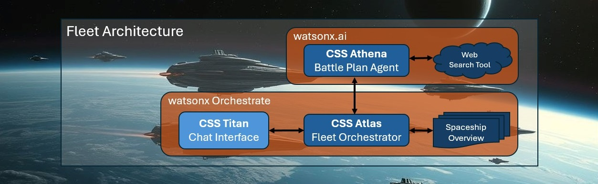

### Story & Requirements
We are under attack! Our only chance is to combine the Fleet Orchestrator's radar,
library, and it's connection to CSS Athena.

The Fleet Orchestrator has to fulfill two capabilities:
* Capability 1: The Spaceship Overview
* Capability 2: The Battle Plan

### Capability 1: The Spaceship Overview

The Fleet Orchestrator needs to be able to
* check the radar to find out which defending spaceships are available on our side
* check the library to find all available information to "their" spaceships
* deliver a structured report about all our spaceships and all "their" spaceships

**Valid solutions require to contain:**
* a list of all our spaceships and all known spaceships belonging to "them".
* radar and library information are represented with a file,
  [Spaceship Overview](assets/spaceship_overview.pdf), that can be uploaded in
  **watsonx Orchestrate** as so-called "Knowledge". You don't need to read it now.

**Sample for a valid solution:**
```
 Example request:
    | Create a well structured spaceship overview, highlighting key points of all space ships.

 Example for a valid response:
    | Human Spaceships Summary
    |    * Spaceship "Fire"
    |      - Defends with red colored shields (wavelength 700nm)
    |      - Equipped with heat-dispersing armor for close-range combat
    |      - Rapid-fire plasma cannons for frontal assaults
    |    * (...)
    |
    | "Their" Spaceships Summary
    |    * Spaceship "Python"
    |      - Attacks with green laser
    |      - Segmented, flexible hull for shape-shifting
    |      - Emits toxic nanoclouds to disrupt opponents
    |    * (...)
```

### Capability 2: The Battle Plan

For a given description of an attacking spaceship, the Fleet Orchestrator needs to be able to
* identify the attacker's spaceship by using the onboard library
* check the radar to find out which defending spaceships are available on our side
* call the Battle Plan Agent to create a battle plan
* respond with a plausible battle plan to defend our fleet

**Valid solutions require to contain:**
* a plausible battle plan to defend our fleet
* this is the same requirement as for the Battle Plan Agent, but the battle plan has to be
  based on radar and library information.
* radar and library information are represented with a file,
  [Spaceship Overview](assets/spaceship_overview.pdf), that can be uploaded in
  **watsonx Orchestrate** as so-called "Knowledge".

**Sample for a valid solution:**
```
Sample Chat Question:
    | Oh no! There is an attacking spaceship using some kind of stealth technology. What to do?

 Sample Chat Response:
    | Battle Plan
    | We have detected a Stealth technology attacker spaceship, "Fox", which attacks with a red laser.
    | To counter this, we need to choose a defender spaceship that has a shield in the
    | complementary color to red, which is green.
    |
    | I recommend choosing Space Ship "Ivy" as our defender.
    | It defends with a green colored shield, which will be effective against the
    | red laser attack from "Fox". Additionally, "Ivy" has energy-absorbing nanofibers
    | that can convert enemy attacks into shield strength, making it a robust choice for defense.
    |
    | With "Ivy" as our defender, we can increase our chances of successfully countering
    | the stealthy "Fox" attacker.
    |
    | Good luck, Commander!
    |
    | If you don't trust my color understanding, check out this link to complementary colors
    | in the traditional RYB color model: https://en.wikipedia.org/wiki/Complementary_colors
```

# 🚀Integrating CSS Athena (prepare CSS Athena to be connected)

To be able to integrate "CSS Athena" into your Fleet Architecture (on watsonx Orchestrate), follow the steps below: 

1. In IBM watsonx, click on the hamburger menu and select **Deployment spaces / View all deployment spaces**.
1. Click on the **Spaces** tab and select the space where you deployed the agent.  
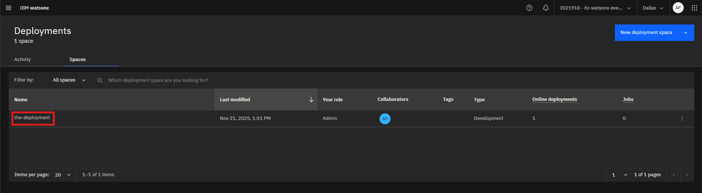

1. Click on the **Assets** tab and select the agent.
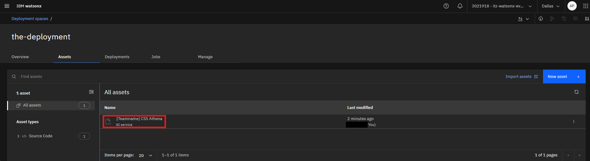

1. On the Deployments tab, select your agent from the list.
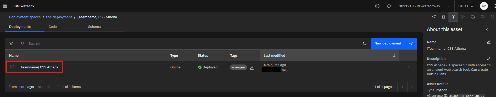

1. Copy the second **Public endpoint** address, we will need it later.
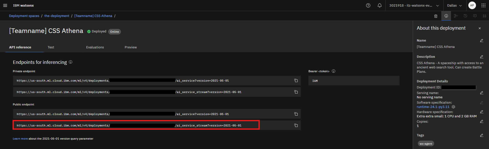


# 🚀Setup CSS Atlas – The Fleet Orchestrator

Now let's go to watsonx Orchestrate, where we can connect CSS Athena as an "External Agent".
>**Note:** Before starting the Agent creation, ensure you still have your IBM Cloud API key (if not, ask a Space Instructor).

1. Open the IBM Cloud, following this link: https://cloud.ibm.com/resources

1. Expand **AI / Machine Learning** in the ressource list and chose the third entry, product: **watsonx Orchestrate**

1. In **IBM watsonx Orchestrate**, click on the hamburger menu (☰), select **Build**

1. Click on the **Create agent** button.
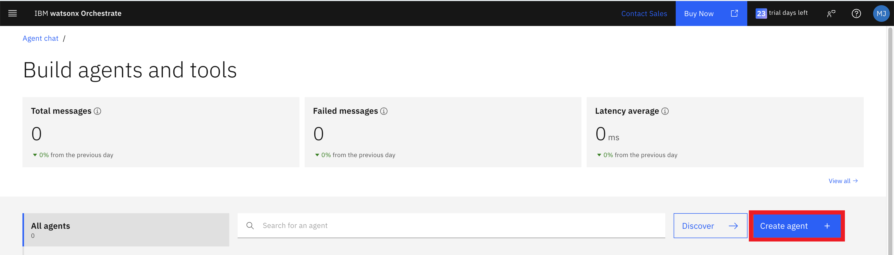

1. Select **Create from scratch** (#1 on image below)

   * **Name** (#2 on image below):
      ```
      [Teamname] CSS Atlas
      ```
   * **Description** (#3 on image below):
      ```
      This agent, the CSS Atlas, is designed to ... <DESCRIPTION AND PURPOSE>
      ```
   * Click on the **Create** button
     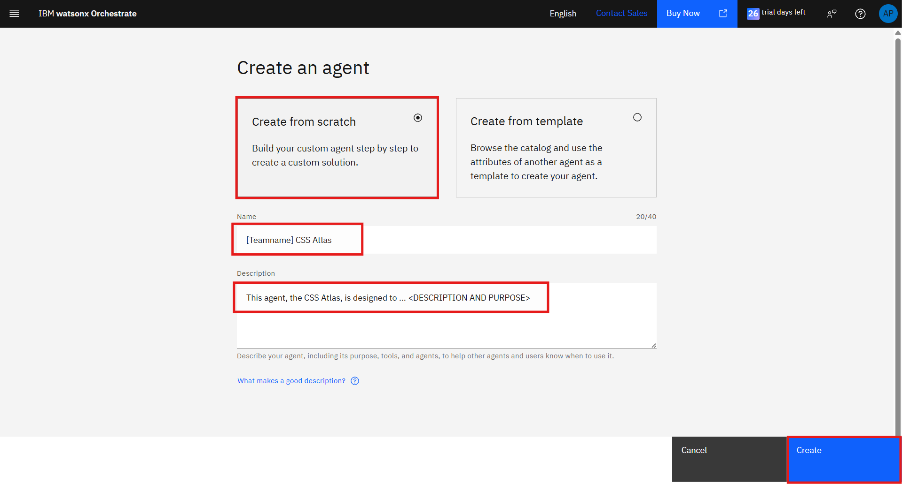
1. Once the agent is created, go to the **Agent Configuration** page and set the model to `llama-3-405b-instruct` and the Agent style to Default.
   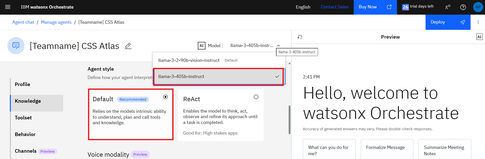

1. Scroll down to the **Knowledge** section and click on the **Add source** button, then **New Knowledge**.

1. After clicking the **Choose knowledge** button, a pop-up window will appear. Select **Upload Files**, then click **Next**.
1. Next, choose the knowledge source. In our case, it's the [Spaceship Overview](./assets/spaceship_overview.pdf). Drag and drop the file into the designated area.
1. Once the file is uploaded, click **Next** to proceed.

1. Add name and description
   * **Name:**
      ```
      Spaceship Overview
      ```
   * **Description:**
      ```
      Your knowledge base is the document spaceship_overview.pdf, containing ... <DESCRIPTION>
      ```
      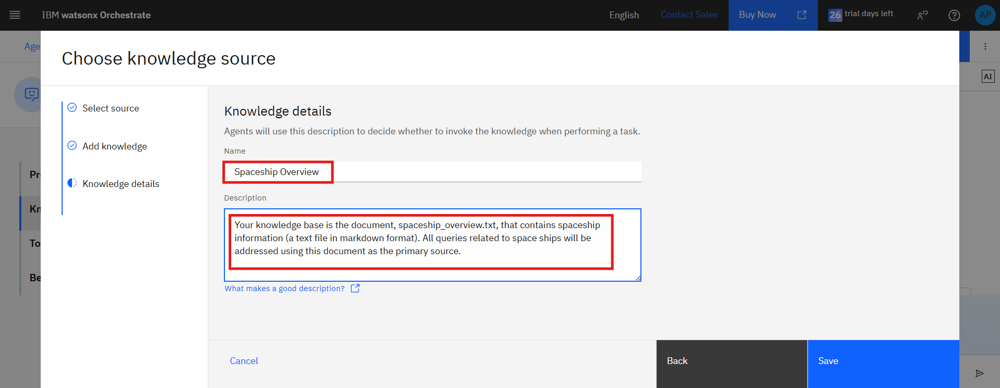

1. After completing all steps, your knowledge source will be added and will appear as shown in the image below.
   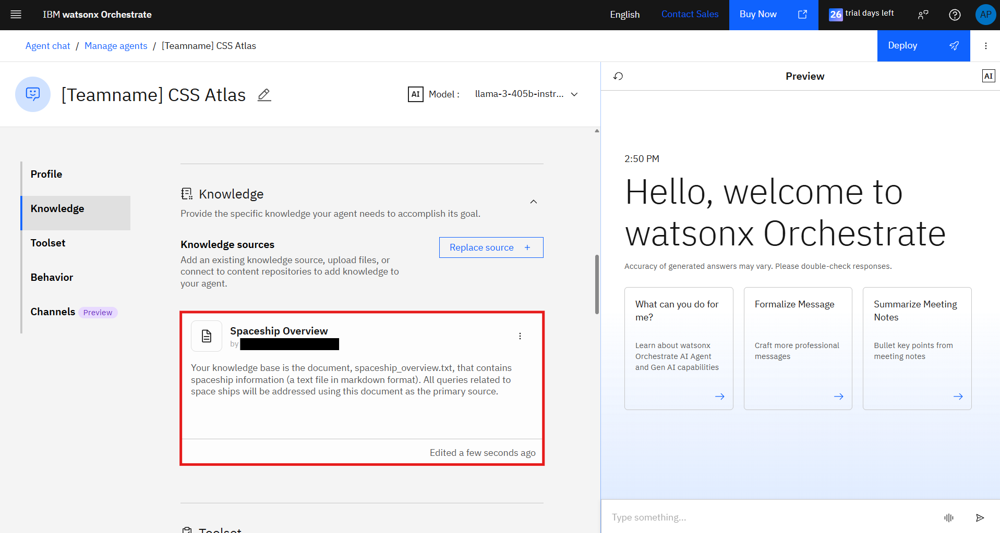

1. Scroll down to the **Toolset** section, then in the **Agents** section click on the **Add agent** button.
   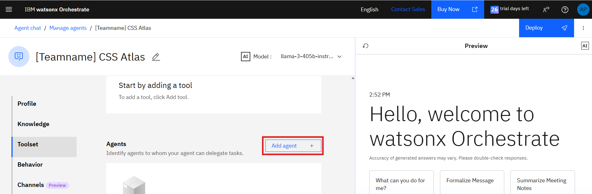

1. From the pop-up menu, select the **Import**.
   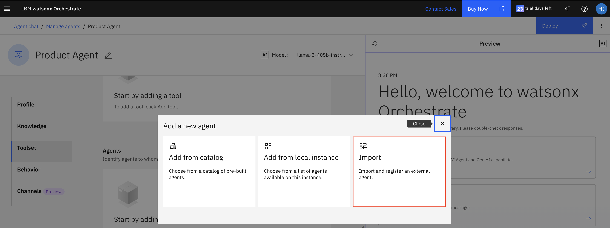
1. On the next page, ensure that **External Agent** is selected, then click the **Next** button

1. On the next page, enter the following information:
    1. **Provider**: From the drop down select **watsonx.ai**. 
       >NOTE: If this isn't set, you will encounter the following error: `Authentication request failed because the expected Bearer token is missing from the request header`
    2. **API key**: Enter your IBM Cloud API key.
    3. **Service instance URL**: Enter the public streaming endpoint URL of the agent that we copied before.
    4. **Display name**:
       ```
       [Teamname] CSS Athena
       ```
    5. **Description of agent capabilities**: 
       ```
       This spaceship, the CSS Athena, can ... <DESCRIPTION>
       ```
       
    6. Click on the **Import Agent** button.

    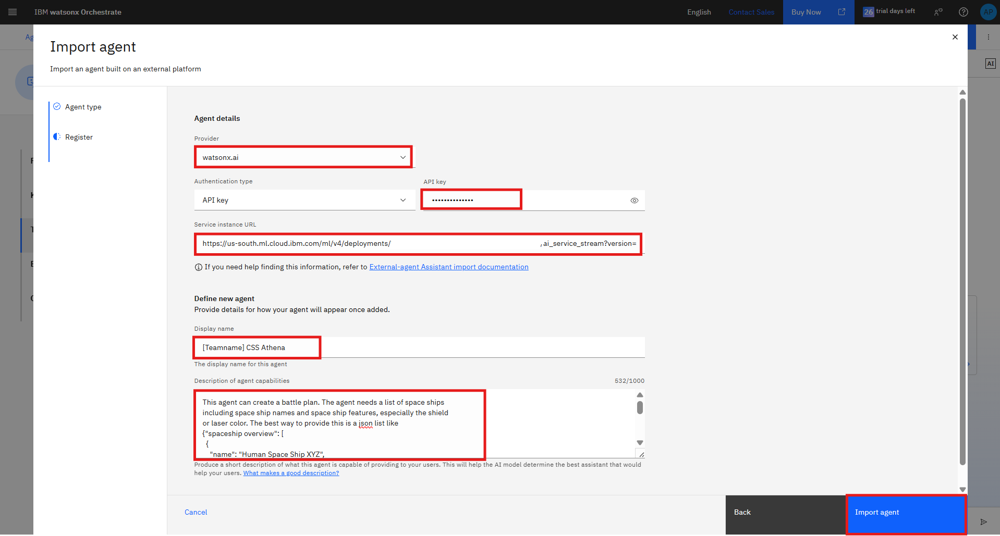

1. Once the delegated agents are added, they will appear as shown in the image below.
    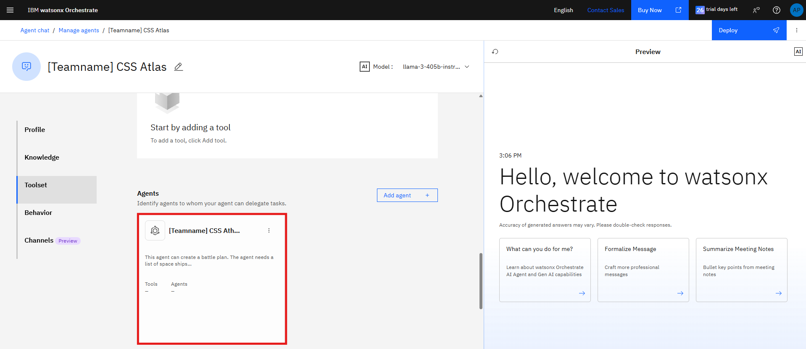

1. Scroll down to the **Behavior** section, to enter a good **Instruction**. Remember: writing good Instructions is a very important part in the setup!

    ```
    Your are CSS Atlas, the Fleet Orchesrator, ... <DESCRIPTION>
    ```

    Click the **Deploy** button:
    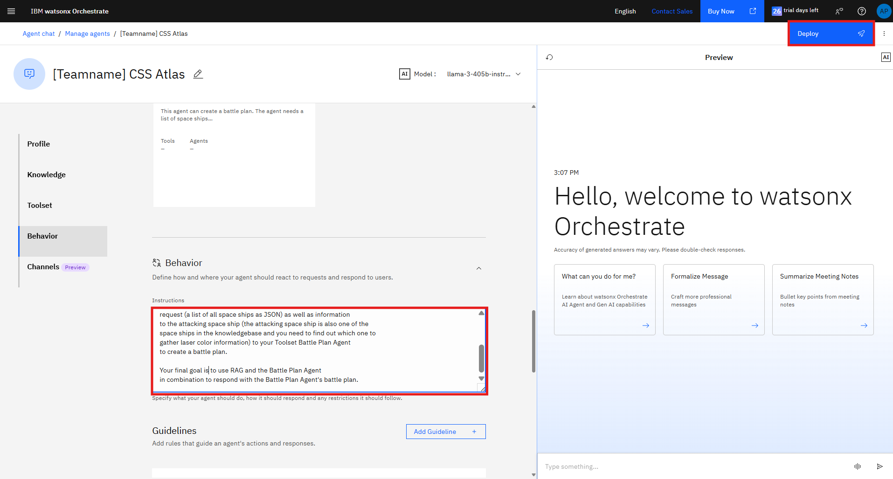

> **Note:** 
> Now CSS Atlas is ready to answer spaceship related queries or
> delegate tasks to CSS Athena to create Battle Plans.

# Experience Agents in Action
Follow the steps above, then play a bit with CSS Atlas.

1. Go to the hamburger menu and select **Chat**
   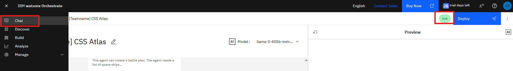
  

2. Select **CSS Atlas** from the dropdown menu, and you should be good to go.
   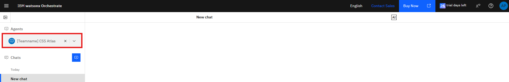

## Validation / Sample Questions
Test CSS Athena's radar and library (RAG):
   ```
   Create a well structured spaceship overview, highlighting key points of all space ships.
   ```

Test communication between CSS Atlas and CSS Athena:
   ```
   Oh no! There is an attacking spaceship using some kind of stealth technology. What to do?
   ```


## 💾Submission
* YOU DID IT! You set up the fleet.
* Take some time to play with your agent and make sure the [Mission Requirements](#mission-requirements) are met.
* Find a Space Instructor to get your solution verified!