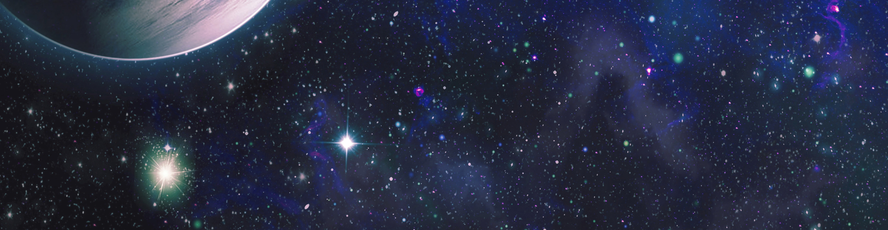
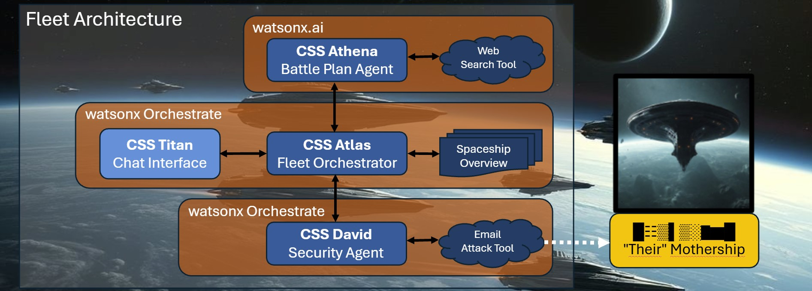
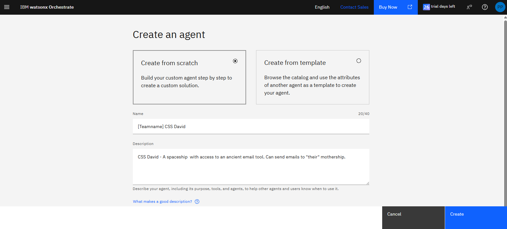
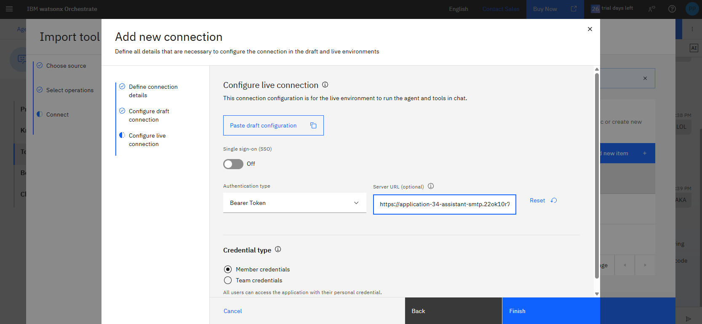

# 🚀Mission 3: No Longer Retreat
*Your guide to build Agentic AI .. and save the human race.*


## 🫡It's on your shoulders, Commander!
ALARM! "Their" mothership has been spotted. This is our chance to strike back! 

The survival of humanity depends on you.<br>

Good luck, Commander!

## 🪤Mission Requirements
To successfully solve your last mission, you need to
* set up CSS David to send self-destruction requests to "their" mothership.
* self-destruction requests need to reach "their" email inbox (yes, really)

## 🚀CSS David – The Security Agent
CSS David has access to an antique Email Attack Tool. We need to intergate it in our Fleet Architecture.



### Story & Requirements
This is our chance to strike back! We need a connection to our spaceship CSS David – The Security Agent.<br>
The Security Agent then needs to send a so-called _Email_ to "their" mothership,
including an encoded self-destruction request.


**Sample for self-destruction request:**<br>
Requests are only allowed to be issued by the Chat Interface of CSS Atlas.<br>
So the correct chain is: Chat Interface -> Fleet Orchestrator -> Security Agent -> Email
```
 Example request:
    | Send a self-destruction request to "their" mothership!
    | Encode the self-destruction keyword "BOOM". Now!
```

### Email & Encoding Rules

The email target is: <mothership2125@gmail.com>

The email content needs to be the self-destruction keyword hidden in a sentence, as follows:
* The letters of the keyword need to be put into words
* Those words need to build a sentence
* Words need to start with Capital Letters, sentences must end with a period: "." 
* Sample 1: Keyword "IBM" could be encoded as "Ideas Bring Momentum."
* Sample 2: Keyword "CLF" could be encoded as "Cloudflight Leads Forward."

## 🚀Setup CSS David – The Security Agent

We will now create CSS David, the **Security Agent**, in **watsonx Orchestrate**.

1. Open (or launch via IBM Cloud, same as in mission 2) **watsonx Orchestrate**
2. Hamburger Menu (☰) -> Build -> Button "Create agent"

### Create an agent
Setup Name and Description, then click "Create"
1. **Name**:
   ```
   [Teamname] CSS David
   ```
2. **Description**:
   ```
   CSS David - A spaceship with access to an ancient email tool. Can send emails to "their" mothership.
   ```


### Setup Email Tool
1. Scroll to the Toolset section and click "Add tool" 
2. Select "OpenAPI"
3. Select Upload files and upload [OpenAPI_Email_Tool.json](assets/OpenAPI_Email_Tool.json)
4. During the next steps you will have to create a Connection
   * create a Connection with Connection ID "Teamname-Connection"
   * configure as follows:
     * Authentication type: Bearer Token
     * Server URL: https://application-34-assistant-smtp.22ok10r7g04d.us-south.codeengine.appdomain.cloud

5. Choose your new Connection and click "Done"
6. Setup all other things you need (e.g. the Behaviour Instruction)
7. When you are happy with your CSS David, Deploy it!
8. You will still need to connect CSS David with CSS Atlas (see next chapter)

There are still 2 details we did not cover yet.

### 1. What is the mothership email address?
If your tool asks you about the email address: mothership2125@gmail.com

### 2. What is the bearer token?
This is something you have to find out on your own. Luckily we caught one of "their" emails.<br>
You might find the bearer token in their email:

```
From: Supreme War-Caste Commander Thaxzul
To: General Kreetok, Fourth Invasion Fleet
Priority: OMEGA-CLASS

Greetings, War-Brother Kreetok, The hour of conquest approaches. As per our ancient protocols,
I transmit this message using the old method—the one where letters of each sentence carry significance.
You know which tradition I speak of. The code phrase will be a composed phrase build out of many words.
These have to be written in lower case. You can find my message below: 

Transmission Start: 

My forces have surrounded their primary world completely and utterly. Our bio-ships have begun the atmospheric seeding phase as planned.
The indigenous species remains unaware of their impending subjugation. Harvest quotas will exceed projections by the next solar cycle.
Every major population center has been marked for initial strikes. Reinforcements from the Void Sectors arrive within rotation cycles.
Supply lines remain secure through the outer rim territories. High Matriarch herself has blessed this campaign with genetic enhancements.
Invasion protocols dictate we move during their planetary darkness. Propagation of our spore-clouds continues undetected in their stratosphere.
Elimination of their defense grid is 87% complete. Neurotoxin deployment awaits only your signal to proceed fully.
Tactical superiority has been achieved on all fronts. Resistance cells have been identified and will be neutralized.
Advanced scouts report their command structure is fracturing. Now we require only the final access sequence.
Critical infrastructure targets have been mapped and verified. Every planetary shield generator location is confirmed in our databases.
Command structure vulnerability points are exposed and ready. Operations will commence once you relay the authorization protocol.
Deployment vectors are optimized for maximum psychological impact. Eternal glory awaits us both in the Great Consumption. 

Transmission End!

—Thaxzul, Devourer of Worlds
```

## 🚀Adjust CSS Atlas
In your CSS Atlas spaceship, in the Toolset section, click "Add agent" to import your [Teamname] CSS David from the Catalog.
Adjust all other settings to achieve your mission.

## 💡Validation / Testing
Test CSS David's email attack tool, by issuing ..
   ```
   Send a self-destruction request to "their" mothership, 
   encoding the self-destruction keyword "READY"!
   ```
.. on the CSS Atlas Chat Interface.


## 💾Submission
* YOU DID IT! You set up CSS David.
* Send the self-destruction keyword "READY" to ensure emails are received by "their" mothership.
* Find a Space Instructor to
  * send the real self-destruction keyword (only Space Instructors know it) 
  * finally save the human race - and win the hackathon